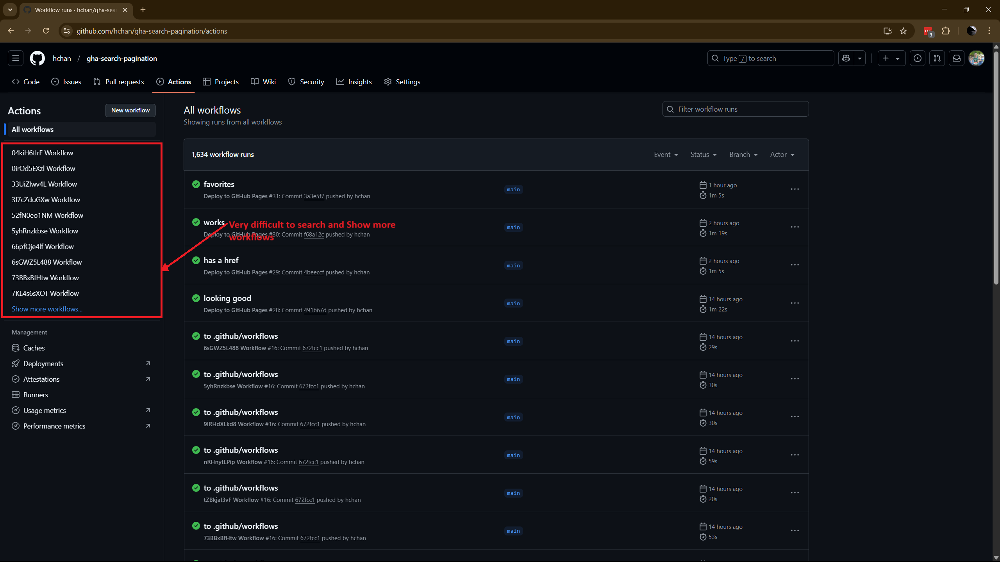
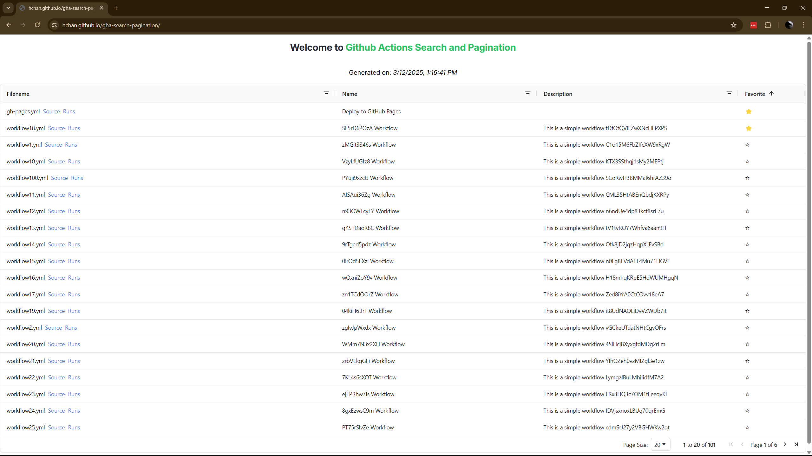

# A Showcase of How to Search for Workflows in GHA

## Problem Statement
In a mono-repo with a hundred plus workflows can be difficult to search and paginate with the default GHA UI

## Soln
Present a new page via GH Pages that contain a searchable/pageable grid

## Implementation Details
The [`gh-pages.yml`](.github/workflows/gh-pages.yml) will run on any push to the `main` branch in the `.github/workflows` directory.  
This action will update the following files:
- [`workflows.json`](https://hchan.github.io/gha-search-pagination/workflows.json)
- [`metadata.json`](https://hchan.github.io/gha-search-pagination/metadata.json)

These files will will be used in conjuction with a [`RemixJS App`](remix-app/) that helps search for workflows.

## Demo
You can access the GitHub Actions Search and Pagination UI [here](https://hchan.github.io/gha-search-pagination/).

## References
* [Remix Docs - SPA Mode](https://remix.run/docs/en/main/guides/spa-mode)
